# Trails West 

This is a project of a website to promote the fictional company Trails West. 
Trails West is a company based in County Kerry; offering guided hikes in the West of Ireland. The service may also include arranging the accommodation and transportation for their customers, renting appropriate outdoor gear and providing snacks or meals for the trails. 
The hike/tour guides are selected contractors based in the counties of the West of Ireland.   
Three individuals manage the company; they share the same passion for the outdoors and love their mutual goal of helping more people to explore and love the nature of that part of the world. 
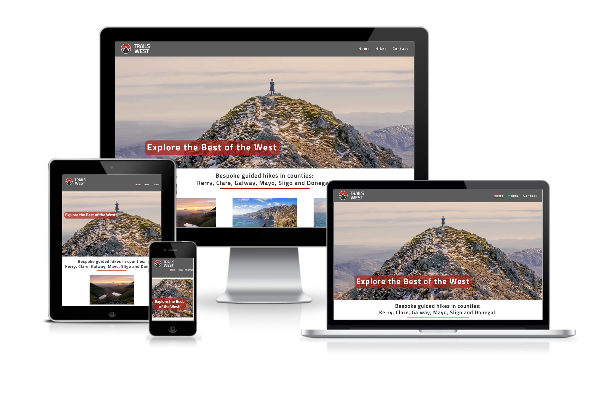

The live site can be seen [here](https://zemaciel.github.io/project-01/).

# Design

## Logo

A logo was designed to give the website a professional look, including variations in the orientation (portrait or landscape) display against dark and light backgrounds.  
The inspiration is the mountains in the West of Ireland, represented in dark grey in the symbol, and the red in the sky, suggesting the sun setting in the West.  
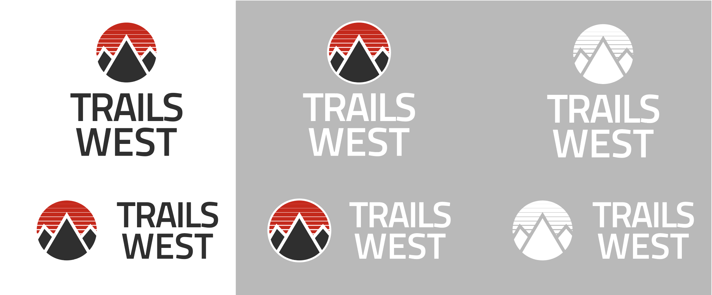
The logo was a good starting point for the design of the site. The colour and the typography were based on the logo. 

## Colours

Dark grey, red, and white are the primary colours for the website. A light shade of grey is used in the index page as a background to help differentiate one section from the other. 
Dark Grey: #E1E1E1
Red: #B70000
Light grey: #333
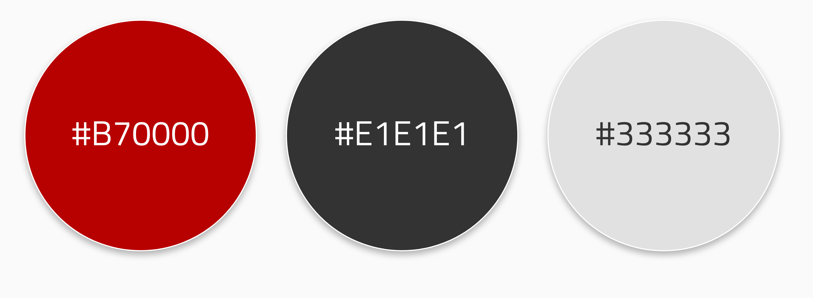

## Typography
Throughout the website, the fonts used are from two  [GoogleFonts](https://fonts.google.com/) families: 
Sunflower – a sans-serif font, the same one used on the TrailsWest logo, is predominately used in the headings on the website.
Lato – a sans-serif font with good legibility used on the paragraph texts. 
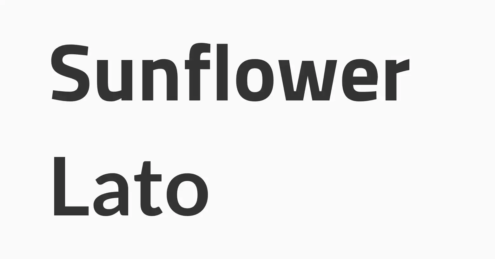

## Mockup
A mockup of the home page was designed in the earlier stage of the project in Adobe XD. Using the defined colours and fonts, it was helpful to have a better understanding of what the final page should look like before typing any line of code.  
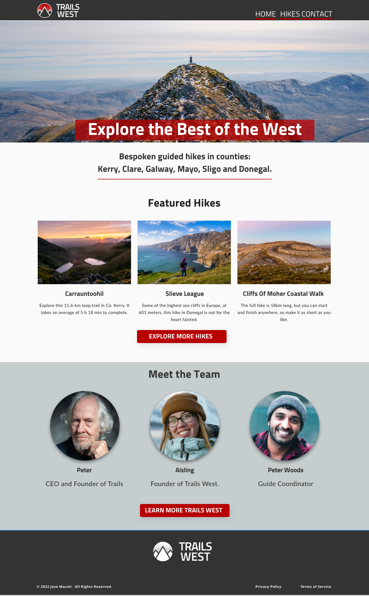

# Existing Features

## Navigation Bar

Navigation Bar is featured on all four pages; the full responsive navigation bar includes links to the Logo, Home page, Hikes Pages and Contact page and is identical on each page to allow for easy navigation.
The current page is indicated on the navigation bar with an underline. 
This section will allow the user to easily navigate from page to page across all devices without using the ‘back’ button.

## Hero Image
Top banners covering the entire page width and displaying a landscape photo of the hikes are on the Home and the Hikes pages.  They also contain texts referent to the page; on the home page, the line "Explore the Best of the West" is an invitation for the user to start exploring the site, and on the hike page, the text is "Our Hikes".
For the pages Contact and Thank You, which have less content, the hero images became the background, filling the screen with a scenic photo. 

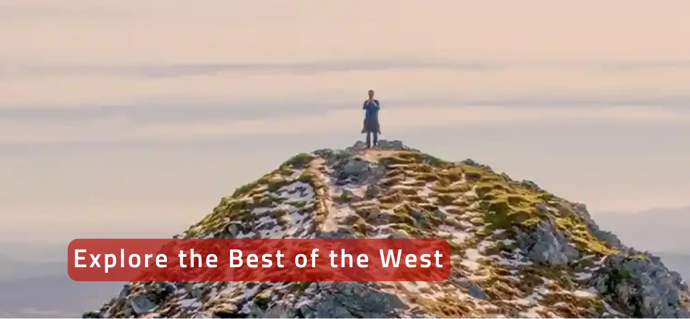

## Intro Section and Featured Hikes
On the home page, just below the hero image and still partially above the fold, sits the introduction section, with a short description of what the company offers, followed by three featured hikes. 
Underneath, a button link to the hike pages. 

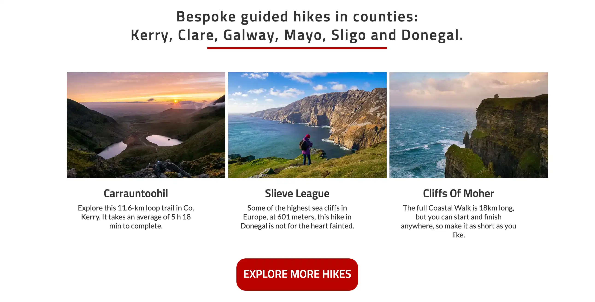

## Meet the Team
The heart and soul of Trails West are the people who manage it and are dedicated to offering the best experience for their company. So on the home page, we present those people, show their faces and tell a few of their stories and passion for exploring. 

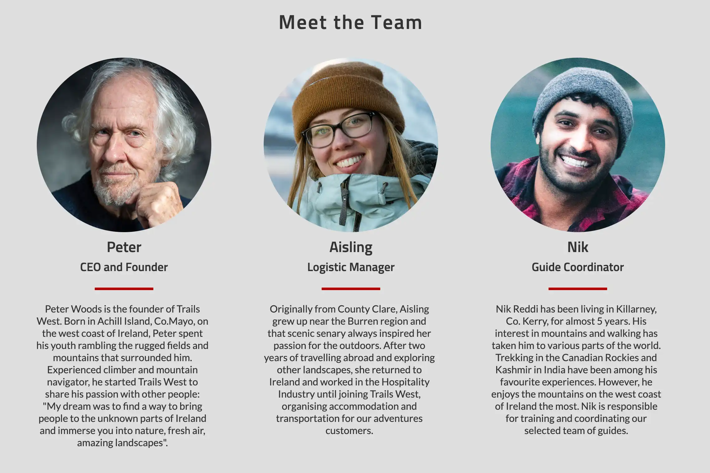

## The Footer 
The footer section includes the following:
 TrailsWest logo, which is linked to the home page; 
links to social media sites. The links will open to a new tab to allow easy navigation for the user. The footer is valuable to the user as it encourages them to keep connected via social media;
Address and telephone details. 

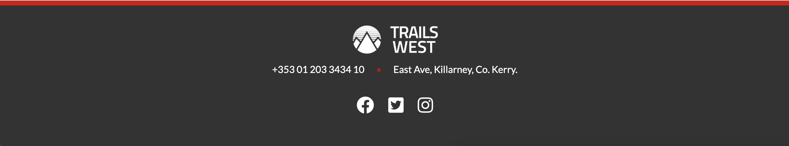

## Hikes

This would be the product section for the Trails West site. 
Below the hero image is a short description of some of the servers offered by the company. 
The most popular hikes are then presented in vertical boxes or cards. They contain a photo, title  and descriptive text. 
At the end of the page, a button with the call to action "book now" directs the user to the contact page. 

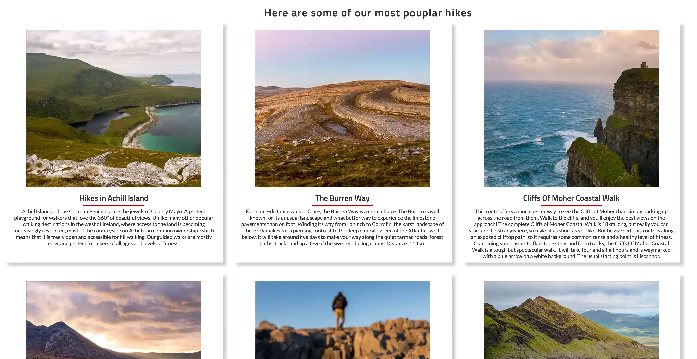

## Contact Page
The user is invited to send an enquiry on the contact page, filling up the fields: Name, email, message and choosing if they prefer a single-day hike, multi-day hike or both. 
The submit button is a bit irreverent, with an [emoji](https://en.wikipedia.org/wiki/Emoji) and a  pun with the expression "Take a Hike". Just a little touch of humour. 

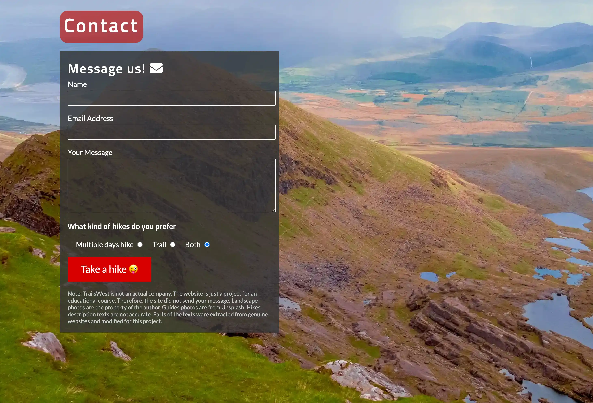

## Thank You Page

After the user clicks the submit button, they are redirected to the "Thank You" page. This page works as feedback indicating that the action of sending a message was completed.
Links to Social Media are displayed more prominently on the page, an invitation for them to continue interacting with the TrailsWest brand.  
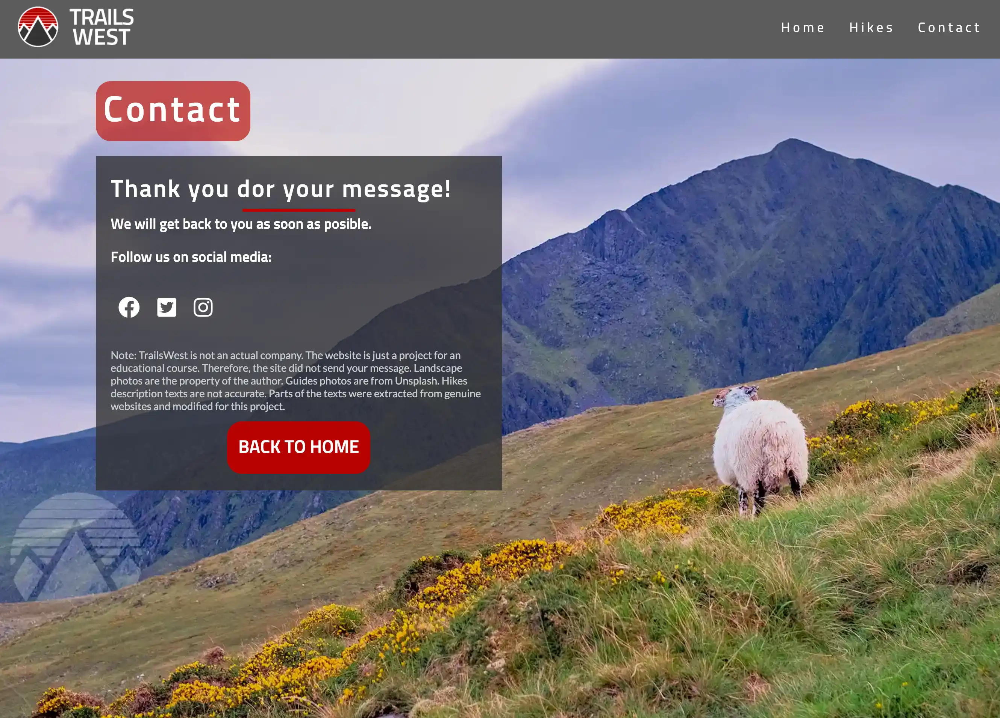

# Future Features
Would be an exciting feature to have the hikes card organized and/or filtered according to their counties, type of hike (single-day, multi-day), level of difficulty and available dates. 
Also, the cards could be linked to a page containing more details about the hikes and including maps. 
There should also be more details about the services provided and the company itself. 
 

# Testing

I have tested the site on Chrome and Firefox on desktop computers with different screen sizes ( 27" and 13") on Chrome and Firefox on Android phones and also using google dev tools. 
While developing this site, I encountered a series of hurdles, which are understandable as this is the first time I've coded a website. 
Positioning and media queries were challenges that consumed more time than I had imagined. And finding small mistakes in the code was a big task as well. 
One of the problems that took most of my time was fixing the footer position to keep it at the bottom of the page at all times. For that, the best alternative I found was using "[display flex](https://css-tricks.com/snippets/css/a-guide-to-flexbox/)". 
Display flex was also the solution to centre the items inside the content of the footer. 

To display the hikes as cards on the hike.html page, ["display grid"](https://www.w3schools.com/css/css_grid.asp) was the chosen solution.    

Getting the media queries to function appropriately required a lot of attempts, but they are functional now.  

The contact form was based on the same contact in the Code Institute Project "Love Running". And my mentor on the project spotted that it wasn't working correctly, and I had to change the action from "Post" to "Get", so it would display the "Thank You" page. 

Testing the site using the Google Dev Tool "Lighthouse" was very helpful in improving the accessibility. The section "Meet the Team" in the home page had a darker background and red text, which Lighthouse indicated as low contrast. I also recommend using images in [webp] (https://developers.google.com/speed/webp) format, which has better performance and I was not very familiar with it. 

I have also learned that copy and pasting can be a curse if you don't pay attention. The same mistake in one line of code in the Footer was present on all pages at some stage. And even when something seems to work on the screen does not mean that it is correct. Place the "[fontawesome] (https://fontawesome.com/) script" under the </body></html> may show the result you wanted, but will not pass a HTML validator test. 

Speaking of which, the site has passed the main validator tests. 

## Validator Testing

### HTML
No errors were returned when passing through the [W3C Validator](https://validator.w3.org/)
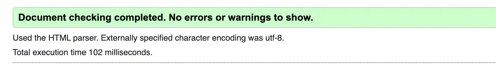

### CSS
No errors were returned when passing through the [Jigsaw validator](https://jigsaw.w3.org/css-validator/)

### Lighthouse testing

## Unfixed Bugs
Deciding between having the project perfect or having it done, the latter was the best choice. 
A few things remain unresolved, but none that affect the site's performance, accessibility or functionalities. 
On the index and hikes pages, there is a small gap between the hero images and the header on smaller screens. 
The content of the "Meet the Team Section" was going over the footer on smaller screens. The problem was fixed using "display flex"; however, now there is a gap on the left-hand-size of the container displaying the 3rd team member.  
When reduced to smaller screens, I wanted the nav bar in the header to be aligned to the center under the logo, and I was not able to find a solution by the time of the submission of this project.
Some images, like the logos on the footer and bottom of the page and the images of the team, have inline styles for width and height in the HTML code. Those attributes should be on the CSS style, but I had problems amending that and had to leave as it is for now. 
 

 

## Main Languages and Applications used 
HTML5 
CSS3 
Google Fonts
Font Awesome 
GitPod 
GitHub
Adobe Illustrator - design of the logo.
Adobe Photoshop - editing images and saving them as Webp.
Adobe XD - initial mockup
Atom - for editing codes offline. 

## Deployment 
The site was deployed to GitHub pages. 
In the GitHub repository, go to the Settings. 
Of the drop-down menu, select the Master Branch
Click ”Save” 
The page reloads with the link to the project: https://zemaciel.github.io/project-01/

##Credits

To complete this project, I had the guidance of Martina Terlevic, my Code Institute mentor, and the help of members of the Code Institute Slack community. They took the time to check my enquires, and shared useful content. I thank you all.   

The header, nav menu and contact page were based on the Love Running Project. 
 
Websites and videos were very helpful: 

###Flexbox: 
 https://css-tricks.com/snippets/css/a-guide-to-flexbox/
Learn Flexbox in 15 Minutes - https://www.youtube.com/watch?v=fYq5PXgSsbE
Learn flexbox the easy way - https://www.youtube.com/watch?v=u044iM9xsWU&t=292s

###Grid
Learn CSS Grid in 20 Minutes - https://www.youtube.com/watch?v=9zBsdzdE4sM

### Other great resources: 
https://developer.mozilla.org/en-US/
https://www.w3schools.com/
https://stackoverflow.com/

### Media
As I enjoy hiking and photography, I have many images of hikes and have used some of them on this site. 
The photos of the team members are from www.unslpash.com. 

Information about the hikes was extracted from different sites and modified. Some of the sources are: 
http://allaroundireland.ie/
https://www.kerryclimbing.ie/
 https://bespoketreksandhikes.com/
https://irelandwalkhikebike.com/
https://www.wildernessireland.com/
https://www.hilltoptreks.com/
www.alltrails.com
https://outsider.ie/
https://sligowalks.ie/

  

